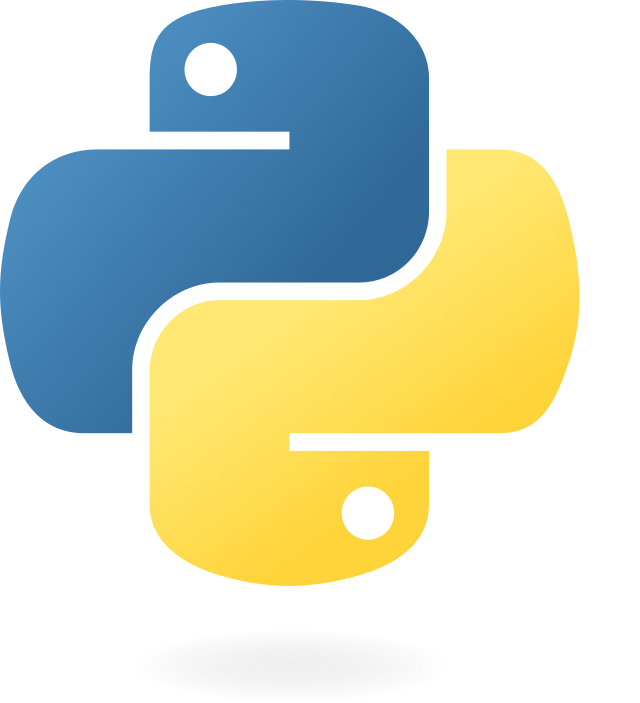

# Programacion Basica con Python

Para empezar a programar en Python, tienes que instalar Python y configurar tu entorno de desarrollo. Puedes descargar Python del sitio web oficial, utilizar Anaconda Python o empezar con DataCamp Workspace para iniciarte en Python en tu navegador.

Repositorio del Curso de Bases de Datos Relacionales
Este repositorio alberga todo el material educativo, ejercicios y actividades prácticas del curso de Bases de Datos Relacionales impartido en el año 2024. Este curso es guiado por el profesor Sr. Carlos Delgado.

## Contenido del Repositorio

- Materiales de Clase: Documentos, presentaciones y notas de clase que cubren conceptos fundamentales y avanzados. Aquí se incluyen temas como el diseño de bases de datos, normalización y SQL avanzado.

- Ejercicios Prácticos: Una variedad de ejercicios diseñados para reforzar el aprendizaje teórico. Cada ejercicio viene con soluciones detalladas para facilitar la autoevaluación y comprensión.

- Proyectos y Casos de Estudio: Proyectos prácticos que simulan situaciones del mundo real, permitiendo a los estudiantes aplicar los conocimientos adquiridos. Estos proyectos abarcan desde la modelación de datos hasta la implementación de bases de datos.

Pasos para clonar el repositorio:

[Copia esta url en tu navegador](https://github.com/duivele/Programacion_basica.git)

Te dirigira a Github donde podras ver el repositorio completo

 

 Autor: Luis Mansilla 
 Fecha: Noviembre 2024